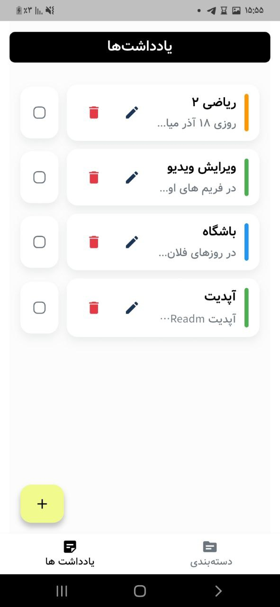
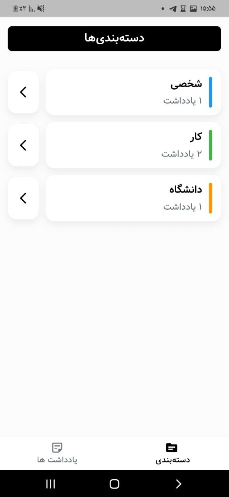
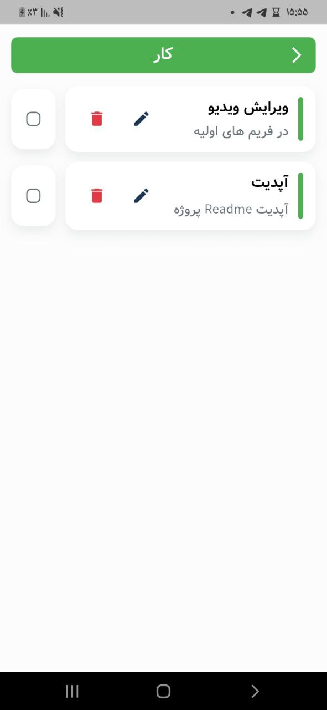
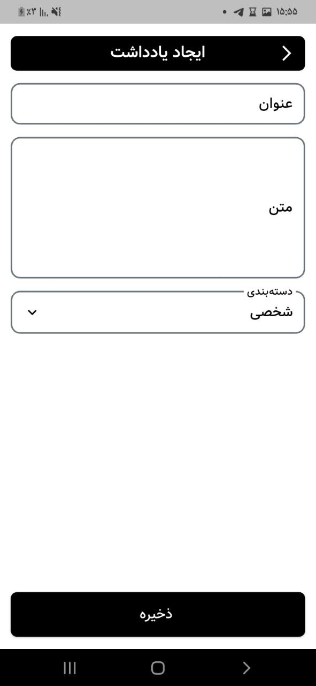
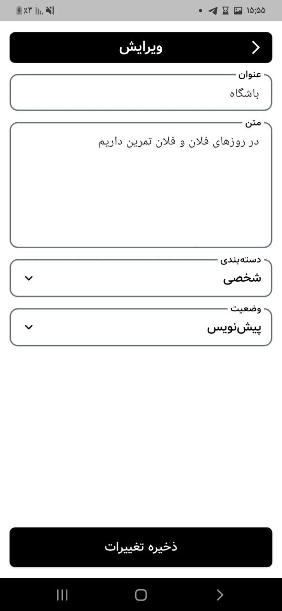

# 📝 Notim

یک اپلیکیشن مدیریت یادداشت‌ها و دسته‌بندی‌ها ساخته شده با Flutter که به شما امکان ایجاد، ویرایش و سازماندهی یادداشت‌های خود را می‌دهد.

## ✨ ویژگی‌ها

- 📌 **مدیریت یادداشت‌ها**: ایجاد، ویرایش و حذف یادداشت‌ها
- 🏷️ **دسته‌بندی**: سازماندهی یادداشت‌ها با دسته‌بندی‌های مختلف
- ✅ **وضعیت یادداشت**: تغییر وضعیت یادداشت‌ها بین پیش‌نویس و تکمیل شده
- 🎨 **رابط کاربری زیبا**: طراحی مدرن و کاربرپسند با پشتیبانی از راست‌چین
- 🔄 **State Management**: استفاده از Provider برای مدیریت وضعیت
- 🧪 **تست‌های واحد**: پوشش کامل تست‌های واحد برای کنترلرها

## 📸 پیش‌نمایش

اپلیکیشن شامل دو صفحه اصلی است:
- **صفحه دسته‌بندی‌ها**: مدیریت دسته‌بندی‌های یادداشت‌ها
- **صفحه یادداشت‌ها**: مشاهده و مدیریت یادداشت‌ها

### اسکرین‌شات‌های اپلیکیشن

<div align="center">

|                                     صفحه یاداشت ها                                     |                                      صفحه دسته بندی                                       |
| :-------------------------------------------------------------------------------------: | :---------------------------------------------------------------------------------------: |
|  |  |

|                                        دسته بندی یاداشت                                        |                                      ایجاد یادداشت                                      |                                      ویرایش                                     |
| :------------------------------------------------------------------------------------------: | :--------------------------------------------------------------------------------------: | :---------------------------------------------------------------------------------------: |
|  |  |  |

</div>

## 🚀 پیش‌نیازها

قبل از شروع، مطمئن شوید که موارد زیر را نصب کرده‌اید:

- [Flutter SDK](https://flutter.dev/docs/get-started/install) (نسخه 3.8.1 یا بالاتر)
- [Dart SDK](https://dart.dev/get-dart) (همراه با Flutter)
- یک ویرایشگر کد (VS Code یا Android Studio)
- یک شبیه‌ساز یا دستگاه فیزیکی برای اجرای اپلیکیشن

## 📦 نصب و راه‌اندازی

### 1. کلون کردن پروژه

```bash
git clone <repository-url>
cd Notim
```

### 2. نصب وابستگی‌ها

```bash
flutter pub get
```

### 3. اجرای اپلیکیشن

```bash
# اجرا روی دستگاه متصل یا شبیه‌ساز
flutter run

# اجرا با مشخص کردن پلتفرم
flutter run -d android
flutter run -d ios
flutter run -d chrome
```

## 🏗️ ساختار پروژه

```
lib/
├── core/                    # کدهای اصلی و مشترک
│   ├── navigation/         # مدیریت ناوبری
│   ├── theme/              # تم و استایل‌ها
│   └── widget/             # ویجت‌های قابل استفاده مجدد
│
├── feature/                 # ویژگی‌های اپلیکیشن
│   ├── managmant_note/     # مدیریت یادداشت‌ها
│   │   ├── controller/     # کنترلرها (State Management)
│   │   ├── model/          # مدل‌های داده
│   │   └── view/           # صفحات UI
│   │
│   └── managment_category/  # مدیریت دسته‌بندی‌ها
│       ├── controller/
│       ├── model/
│       └── view/
│
└── main.dart               # نقطه ورود اپلیکیشن

test/                       # تست‌های واحد
├── note_controller_test.dart
└── categories_controller_test.dart
```

## 🛠️ تکنولوژی‌های استفاده شده

- **Flutter**: فریمورک اصلی توسعه
- **Provider**: مدیریت وضعیت (State Management)
- **Material Design**: طراحی رابط کاربری
- **Font Vazir**: فونت فارسی برای نمایش بهتر متن‌های فارسی

## 📚 نحوه استفاده

### ایجاد یادداشت جدید

1. به صفحه "یادداشت‌ها" بروید
2. روی دکمه افزودن (+) کلیک کنید
3. عنوان و محتوای یادداشت را وارد کنید
4. یک دسته‌بندی انتخاب کنید
5. یادداشت را ذخیره کنید

### ویرایش یادداشت

1. روی یادداشت مورد نظر کلیک کنید
2. اطلاعات را ویرایش کنید
3. تغییرات را ذخیره کنید

### مدیریت دسته‌بندی‌ها

1. به صفحه "دسته‌بندی‌ها" بروید
2. دسته‌بندی‌های موجود را مشاهده کنید


## 🧪 اجرای تست‌ها

### اجرای همه تست‌ها

```bash
flutter test
```

### اجرای یک فایل تست خاص

```bash
# تست کنترلر یادداشت‌ها
flutter test test/note_controller_test.dart

# تست کنترلر دسته‌بندی‌ها
flutter test test/categories_controller_test.dart
```

## 📋 وابستگی‌ها

### Dependencies

- `flutter`: SDK اصلی Flutter
- `provider: ^6.1.5+1`: مدیریت وضعیت
- `cupertino_icons: ^1.0.8`: آیکون‌های iOS

### Dev Dependencies

- `flutter_test`: فریمورک تست Flutter
- `flutter_lints: ^5.0.0`: قوانین linting

## 🎨 معماری پروژه

این پروژه از معماری **Feature-Based** استفاده می‌کند:

- **Separation of Concerns**: جداسازی منطق، داده و UI
- **State Management**: استفاده از Provider برای مدیریت وضعیت
- **Reusable Components**: ویجت‌های قابل استفاده مجدد در پوشه `core/widget`
- **Clean Architecture**: ساختار تمیز و قابل نگهداری

## 📝 یادداشت‌های توسعه

### افزودن ویژگی جدید

1. یک پوشه جدید در `lib/feature/` ایجاد کنید
2. ساختار `controller/`, `model/`, `view/` را ایجاد کنید
3. کنترلر را در `main.dart` به `MultiProvider` اضافه کنید

### افزودن تست جدید

1. فایل تست را در پوشه `test/` ایجاد کنید
2. از ساختار موجود در تست‌های موجود استفاده کنید
3. تست را با `flutter test` اجرا کنید


**ساخته شده با ❤️ و Flutter**
